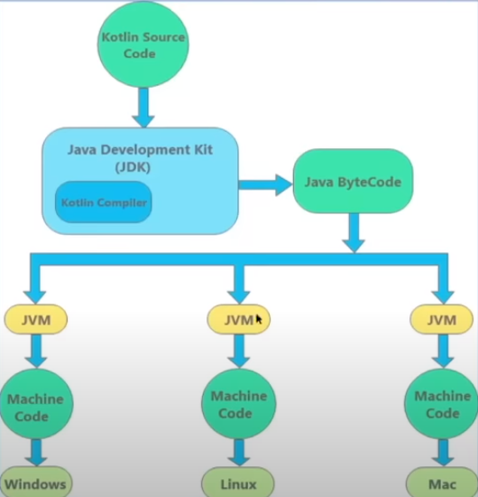

# KOTLIN CHEATSHEET

## FROM KOTLIN SOURCE TO MACHINE CODE

* Java ByteCode, state that can translate to multiples Machine code

## Number types
`Int` \
`Short` \
`Long` \
`Float` \
`Double`

## Null Type